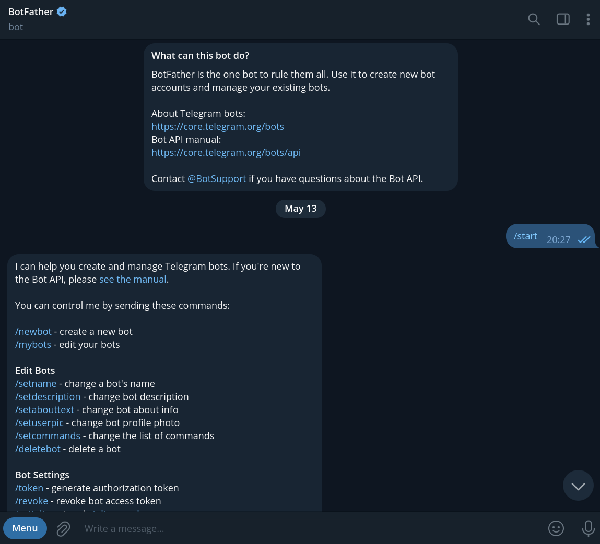
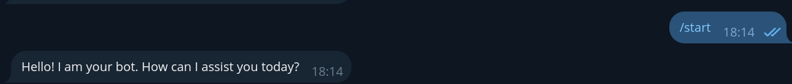
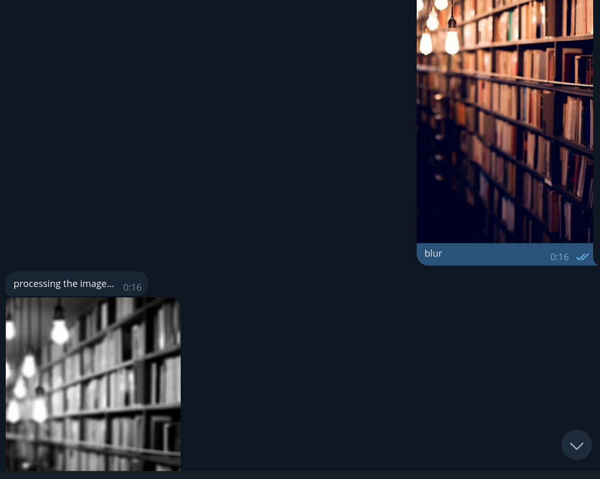

# Polybot Service

## Description

Polybot Service is a Telegram bot that allows users to apply filters to the images they send. This project aims to provide a fun and interactive way for users to enhance their images with various filters.

## Table of Contents

- [Features](#features)

- [Prerequisites](#Prerequisites)

- [Installation](#Installation)

- [Usage](#Usage)

- [Contributing](#contributing)

- [License](#license)

## Features

- Apply filters to images: Users can send an image to the bot and apply some filters: Blur, Contour, Rotate, Salt and pepper, Concat and Segment.
- Interactive interface: The bot provides an intuitive and user-friendly interface for selecting and applying filters.
- Fast Filter Applying: the user will get his image in seconds and filtered.

## Prerequisites

Before running the library manager program, make sure you have the following prerequisites installed:

- Python 3: You need to have Python 3 installed on your system. You can download it from the official Python website: https://www.python.org/downloads/

- Git: You need to have Git installed on your system to clone the repository. You can download it from the official Git website: https://git-scm.com/downloads/

- Pip: Pip is the package installer for Python. It is usually installed by default with Python. You can check if it is installed by running the following command in your terminal:

    ```
    pip --version
    ```

    If it is not installed, you can install it by following the instructions on the official Pip website: https://pip.pypa.io/en/stable/installing/

- Ngrok: Ngrok can solve this problem by creating a secure tunnel between the local machine (where the bot is running) and a public URL provided by Ngrok. It exposes the local server to the internet, allowing Telegram servers to reach the webhook URL and send updates to the bot.<br><br>
If it is not installed, you can install it by following the instruction in the official Ngrok website: https://ngrok.com/docs/getting-started/?os=macos#step-2-install-the-ngrok-agent

Once you have installed these prerequisites, you can proceed with the steps mentioned in the "Getting Started" section to run the library manager program.


## Installation

1. Clone the repository:

   ```shell
   git clone https://github.com/MohammadKhGh99/PolybotServicePythonFursa.git
   ```

2. Install the required dependencies:

   ```shell
   pip install -r polybot/requirements.txt
   ```

3. Set up Ngrok connection:
   - First  you have to sign up for the Ngrok service https://ngrok.com/
   - Once you are logged in, go over the instructions in Setup & Installation https://dashboard.ngrok.com/get-started/setup
   - When running the command `ngrok http` run this command:
      ```
      ngrok http 8443
      ```
      and not the command in Ngrok website, because the app run on 8443 port.
   - When the command ran,
    you will see "Forwarding   'some-link' -> http://localhost:8443", copy the 'some-link' and make an environment variable called TELEGRAM_APP_URL with the link as its value like this:
      - Windows: 
         ```
         setx TELEGRAM_APP_URL "some-link"
         ```
      - Linux and macOS: 
         ```
         export TELEGRAM_APP_URL="some-link"
         ```

4. Set up your Telegram bot:

   - Create a new bot on Telegram and obtain the API token, follow this link https://core.telegram.org/bots/features#botfather to create the bot.
   
   - When you create the bot you will see a token.
   - Set an environment variable with the token like this:
      - Windows: 
         ```
         setx TELEGRAM_TOKEN "token"
         ```
      - Linux and macOS: 
         ```
         export TELEGRAM_TOKEN="token"
         ```


5. Run the bot:

   ```shell
   python app.py
   ```

## Usage

1. Start a chat with the bot on Telegram.

2. Send an image to the bot, with a caption choosing which filter you want [Blur, Contour, Rotate, Salt and pepper, Concat, Segment].


## Contributing

Contributions are welcome! If you have any ideas, suggestions, or bug reports, please open an issue or submit a pull request.

## License
This project is licensed under the MIT License - see the [LICENSE](LICENSE) file for details.